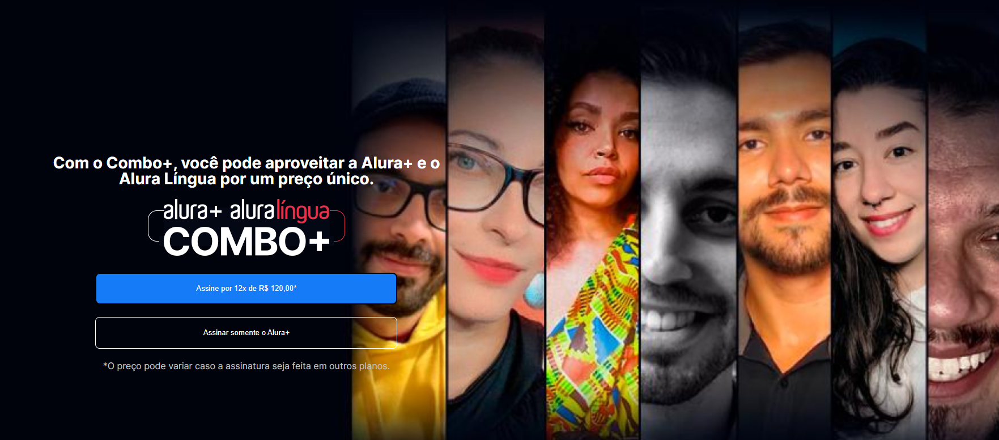

<h1 align="center" font-size="30px"> Alura Plus :us:</h1>

It was a short Alura's project, within a course for practice HTML and CSS.

Note: This site has no responsivity, it was made and finished under the desktop first model.

| 🪧 Vitrine.Dev  |     |
| -------------- | --- |
| ✨ Name        | **Alura Plus** |
| 🏷️ Technologies | HTML e CSS  |
| 🚀 URL         | [**Acesse o site**](https://ramoscarloseduardo.github.io/Alura-Plus/) |
| 🔥 Challenge     | [**Protótipo do Figma**](https://www.figma.com/file/tFDVyNuKhrT2G03k2dCstW/Alura-Plus---Layout) |

<h1 align="center" font-size="30px"> Alura Plus :brazil:</h1>

Foi um pequeno projeto da Alura, dentro de um curso para prática de HTML e CSS.

Nota: Este site não possui responsividade, ele foi feito e finalizado no modelo *desktop first*.

| 🪧 Vitrine.Dev  |     |
| -------------- | --- |
| ✨ Nome        | **Alura Plus** |
| 🏷️ Tecnologias | HTML e CSS  |
| 🚀 URL         | [**Acesse o site**](https://ramoscarloseduardo.github.io/Alura-Plus/) |
| 🔥 Desafio     | [**Protótipo do Figma**](https://www.figma.com/file/tFDVyNuKhrT2G03k2dCstW/Alura-Plus---Layout) |
